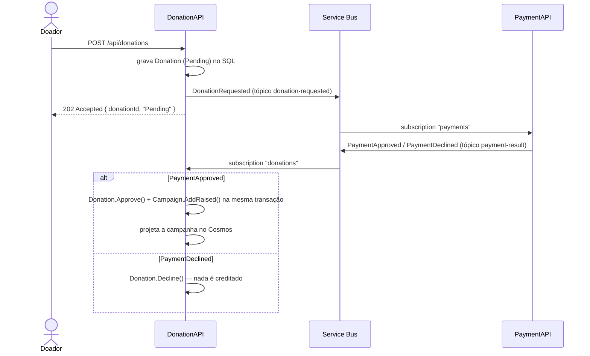

# HackatonFiap.Donations — DonationAPI

Microsserviço central da plataforma **Conexão Solidária** (Hackathon FIAP PosTech). Concentra três frentes: **campanhas** (CRUD e ciclo de vida), **doações** (saga coreografada com a PaymentAPI, mais o consumer idempotente que consolida o valor arrecadado) e **transparência** (leitura pública servida exclusivamente do read model em Cosmos DB).

> **Ecossistema (6 repositórios):** `donations` (este) · `users` · `payments` · `notifications` · `front` · `orchestration`. Mapa completo no [orchestration](https://github.com/GabrielVeridico/hackaton-fiap-orchestration#ecossistema).

## Stack

| Item | Escolha |
|------|---------|
| Runtime | .NET 8 / ASP.NET Core |
| Arquitetura | Clean Architecture — Domain → Application → Infrastructure → API |
| CQRS | Handlers manuais retornando `Result<T>` (sem MediatR) |
| Escrita | EF Core 8 + SQL Server (`HackatonFiapDonationsDb`), migrations aplicadas no startup |
| Leitura | Cosmos DB como read model do painel de transparência; fallback em memória apenas em `Development` |
| Mensageria | Azure Service Bus — publisher, `PaymentResultConsumer` e `CampaignExpirationWorker` (ambos `BackgroundService`) |
| Autenticação | JWT emitido pela UserAPI, validado localmente |
| Observabilidade | Serilog, OpenTelemetry, Prometheus em `/metrics` |
| Testes | xUnit + NSubstitute + FluentAssertions |

A separação entre escrita (SQL) e leitura (Cosmos) é o CQRS levado à persistência: o painel público consulta o Cosmos e nunca compete com as transações de doação pelo mesmo banco.

## Papel na saga de doação

A saga é coreografada — não há orquestrador. Cada serviço reage a um evento e publica o próximo.



O `PaymentResultConsumer` roteia a mensagem pelo `Subject` (`PaymentApproved` ou `PaymentDeclined`).

Regras que valem a pena conhecer antes de ler o código:

- **Idempotência.** Uma tabela de inbox, `ProcessedEvent`, tem `DonationId` como chave primária. Reprocessar o mesmo resultado de pagamento não recredita a campanha.
- **Fonte de verdade.** A consolidação usa a doação persistida, não os valores que vieram no evento. Campanha e valor foram validados no `POST`; o evento não pode alterá-los.
- **Estados terminais não mudam.** Se a campanha foi cancelada ou expirou entre a intenção e o resultado do pagamento, a doação fica `Approved` (o pagamento de fato ocorreu), mas o valor **não** é somado à campanha.
- **Meta atingida.** Quando `AmountRaised >= Goal`, a campanha passa a `Completed` com motivo `GoalReached`.
- **Expiração.** O `CampaignExpirationWorker` varre periodicamente as campanhas `Active` vencidas e as conclui com motivo `Expired`, reprojetando no Cosmos.

### Enums no contrato HTTP

Requisições usam **inteiro**; respostas devolvem **string**.

| Enum | Valores |
|------|---------|
| `paymentMethod` (request) | `0` Pix · `1` CreditCard · `2` BankTransfer |
| `action` (request de mudança de status) | `0` Close (encerramento manual) · `1` Cancel |
| Status da doação (response) | `Pending` · `Approved` · `Declined` |
| Status da campanha (response) | `Active` · `Completed` · `Cancelled` |

## Endpoints

### Campanhas — `/api/campaigns` (papel `GestorONG`; o Owner é um `GestorONG` com `isOwner=true`)

| Método | Rota | Resposta |
|--------|------|----------|
| POST | `/api/campaigns` | 201 com o `id`. 400 quando título vazio, meta ≤ 0, data-fim no passado ou fim antes do início |
| PUT | `/api/campaigns/{id}` | 204. Mesmas validações do POST. 404 quando não existe; 409 quando a campanha já saiu de `Active`. Não altera o valor arrecadado |
| PATCH | `/api/campaigns/{id}/status` | 204. 404 quando não existe; 409 quando a campanha já saiu de `Active` |
| GET | `/api/campaigns` | 200 com a lista completa |
| GET | `/api/campaigns/{id}` | 200 / 404 |

### Doações — `/api/donations` (papel `Doador`)

| Método | Rota | Resposta |
|--------|------|----------|
| POST | `/api/donations` | **202** — grava `Pending` e publica o evento. 400 quando o valor é ≤ 0; 422 quando a campanha não existe, não está ativa ou a doação está fora do período |
| GET | `/api/donations` | 200 com as doações do próprio doador |
| GET | `/api/donations/{id}` | 200 / 404. Só devolve a doação cujo `DonorId` bate com a claim do token |

### Transparência — `/api/transparency` (público)

| Método | Rota | Resposta |
|--------|------|----------|
| GET | `/api/transparency/campaigns` | 200 com as campanhas `Active`: `id`, título, meta, arrecadado e percentual. Lê apenas do read model |

### Operação

| Rota | Descrição |
|------|-----------|
| `GET /health` | Liveness |
| `GET /ready` | Readiness — checa o SQL Server |
| `GET /metrics` | Métricas Prometheus: `donations_received_total`, `donations_approved_total`, `donations_declined_total`, `campaigns_completed_total`, `amount_raised_total` |

Há também Swagger UI em `/swagger`.

## Como rodar localmente

Pré-requisitos: **.NET 8 SDK** e **Docker** (para o SQL Server).

```bash
export DOTNET_CLI_TELEMETRY_OPTOUT=1

# 1) Escolha a senha do SA. Ela precisa atender à política do SQL Server
#    (8+ caracteres, com maiúscula, minúscula, número e símbolo). Não commite este valor.
export SA_PASSWORD='<SENHA_FORTE>'

docker run -e "ACCEPT_EULA=Y" -e "SA_PASSWORD=$SA_PASSWORD" \
  -p 1433:1433 -d mcr.microsoft.com/mssql/server:2022-latest

# 2) Configuração mínima
export ASPNETCORE_ENVIRONMENT=Development
export ConnectionStrings__Default="Server=localhost,1433;Database=HackatonFiapDonationsDb;User Id=sa;Password=$SA_PASSWORD;TrustServerCertificate=true;"

# 3) Build e execução — as migrations são aplicadas no startup
dotnet build HackatonFiap.Donations.sln -c Release
dotnet run --project src/HackatonFiap.Donations.API
```

Em `Development`, a ausência de `ServiceBus:ConnectionString` e de `Cosmos:ConnectionString` é tolerada: o publisher vira no-op, o consumer não sobe e o read model passa a ser em memória. A API sobe sozinha, mas a saga só roda ponta a ponta com um broker.

Para exercitar a saga completa (quatro serviços, Service Bus emulado e um smoke test), use [orchestration/local](https://github.com/GabrielVeridico/hackaton-fiap-orchestration/tree/master/local). Ali este serviço responde em `http://localhost:5003`.

### Docker

```bash
docker build -t hackatonfiap-donations:local .
```

A imagem expõe a porta **8080**.

## Configuração

Todas as chaves usam `__` como separador quando lidas de variável de ambiente.

| Chave | Variável de ambiente | Obrigatória | Observação |
|-------|----------------------|-------------|------------|
| `ConnectionStrings:Default` | `ConnectionStrings__Default` | sempre | SQL Server (escrita) |
| `Cosmos:ConnectionString` | `Cosmos__ConnectionString` | fora de `Development` | Sem ela, em `Development`, o read model é em memória |
| `Cosmos:Database` | `Cosmos__Database` | não | Padrão `HackatonFiapDonations` |
| `Cosmos:Container` | `Cosmos__Container` | não | Padrão `campaigns` |
| `ServiceBus:ConnectionString` | `ServiceBus__ConnectionString` | fora de `Development` | Sem ela, em `Development`, publisher no-op e consumer desligado |
| `ServiceBus:RequestTopic` | `ServiceBus__RequestTopic` | não | Padrão `donation-requested` |
| `ServiceBus:ResultTopic` | `ServiceBus__ResultTopic` | não | Padrão `payment-result` |
| `ServiceBus:ResultSubscription` | `ServiceBus__ResultSubscription` | não | Padrão `donations` |
| `Campaigns:ExpirationScanIntervalSeconds` | `Campaigns__ExpirationScanIntervalSeconds` | não | Intervalo do worker de expiração; padrão 60 |
| `Jwt:Key` | `Jwt__Key` | fora de `Development` | Mesma chave usada pela UserAPI |
| `Jwt:Issuer` | `Jwt__Issuer` | não | Padrão `conexaosolidaria.local` |
| `Jwt:Audience` | `Jwt__Audience` | não | Padrão `conexaosolidaria.clients` |

Nenhum segredo é versionado; no AKS eles chegam do **Azure Key Vault** via CSI Driver + Workload Identity.

## Testes

```bash
dotnet test HackatonFiap.Donations.sln -c Release
```

São **34 testes** cobrindo o domínio (ciclo de vida de `Campaign`, `Period`, criação de `Donation`), os handlers de comando e query, e o comportamento do consumer de resultado de pagamento — incluindo a idempotência e a recusa de creditar campanha em estado terminal.

## CI/CD

`.github/workflows/ci-cd.yaml`. A cada push ou pull request na `main`, e sob `workflow_dispatch`:

- **Job `ci`** — `dotnet restore`, `build`, `test` e `docker build`. Roda sempre, sem depender de nenhum segredo.
- **Job `cd`** — condicionado a `vars.DEPLOY_TO_AKS == 'true'`. Sem essa variável o pipeline fecha verde só com a CI.

O deploy faz login federado por **OIDC**, envia a imagem ao **ACR** e promove no AKS com `kubectl set image` no namespace `conexao-solidaria`. O Deployment é criado pelo **Helm** (`orchestration/iac/deploy-apps.ps1`); o CD apenas troca a imagem. Runbook completo em [orchestration/iac/DEPLOY-AZURE.md](https://github.com/GabrielVeridico/hackaton-fiap-orchestration/blob/master/iac/DEPLOY-AZURE.md).

## Estrutura de pastas

```
src/
├── HackatonFiap.Donations.Domain/          # Campaign, Donation, ProcessedEvent, Period, Result<T>
├── HackatonFiap.Donations.Application/     # handlers CQRS, portas, eventos de integração, métricas
├── HackatonFiap.Donations.Infrastructure/  # EF Core, Service Bus, read store (Cosmos/memória), workers
└── HackatonFiap.Donations.API/             # controllers, mapeamento de erro para HTTP, Program.cs
tests/
└── HackatonFiap.Donations.UnitTests/
```

Fluxo de dependência: `Domain ← Application ← Infrastructure`, com a API apontando para Application e Infrastructure.
